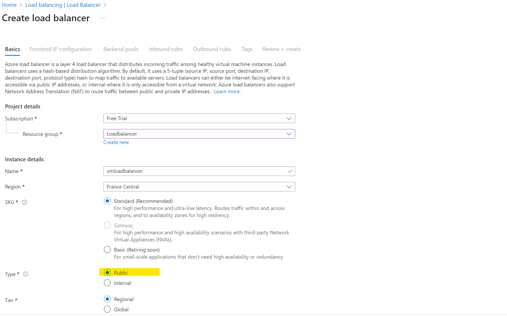

# Load Balancing using the Virtual Machine based on IP
Here we will learn how do manag the traffice coming on our webiste by using VMs.
IN this case VMs are already created we will just attach the load balancer.
Note: Here we are using Virtual Machine, so we need to decide on how much instance/VM we will distribute our load. Unlike VMSS Vm instances will not automitically scale.

    1. Search for Load Balancer in Azure.
    2. Click on +  to start creating one.
    3. Follow teh steps as mentioned in attached images of this file.
    